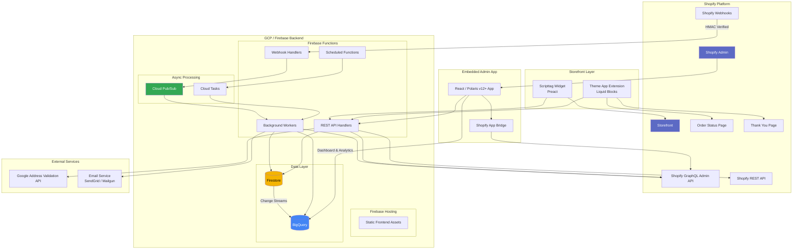
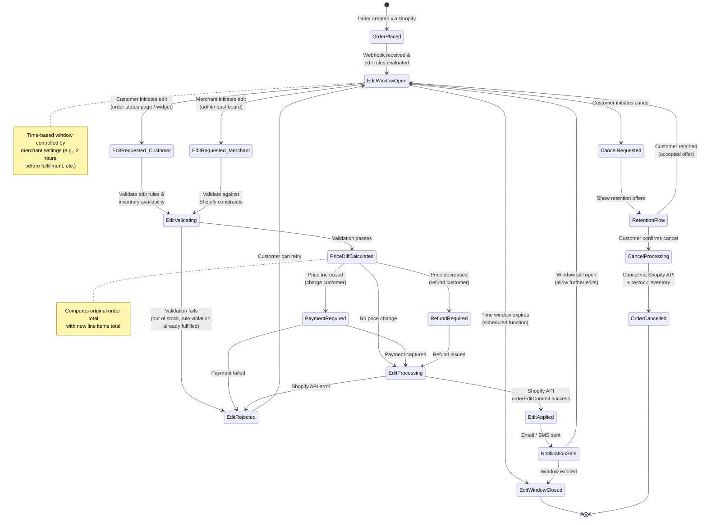
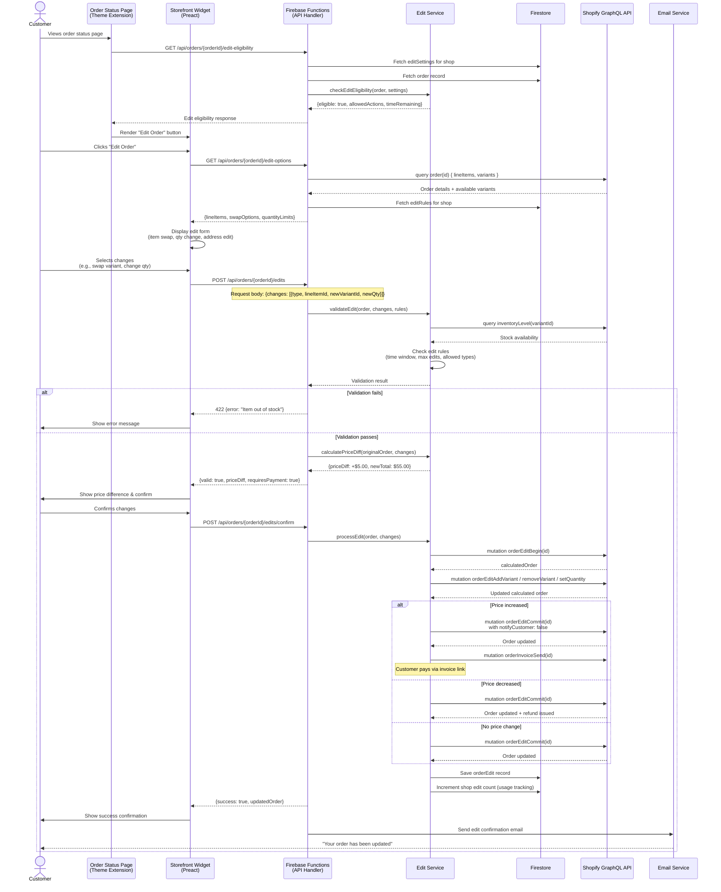
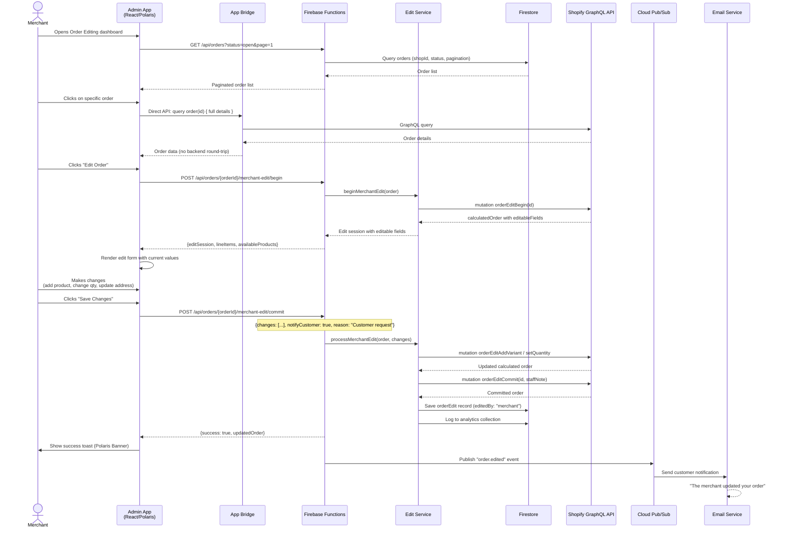
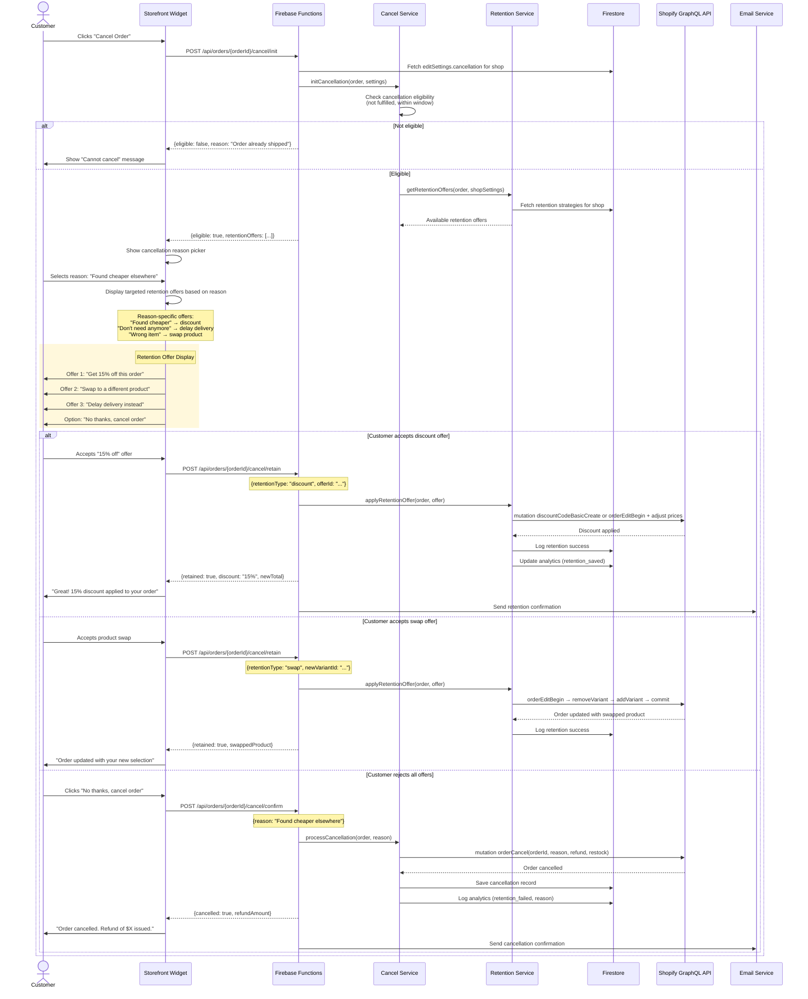
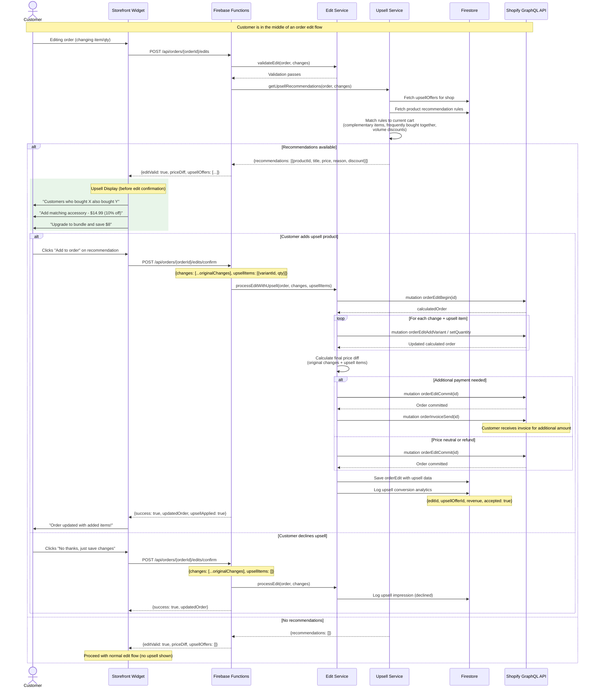
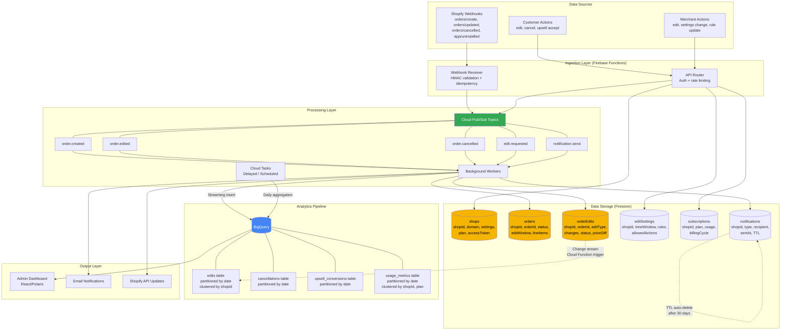
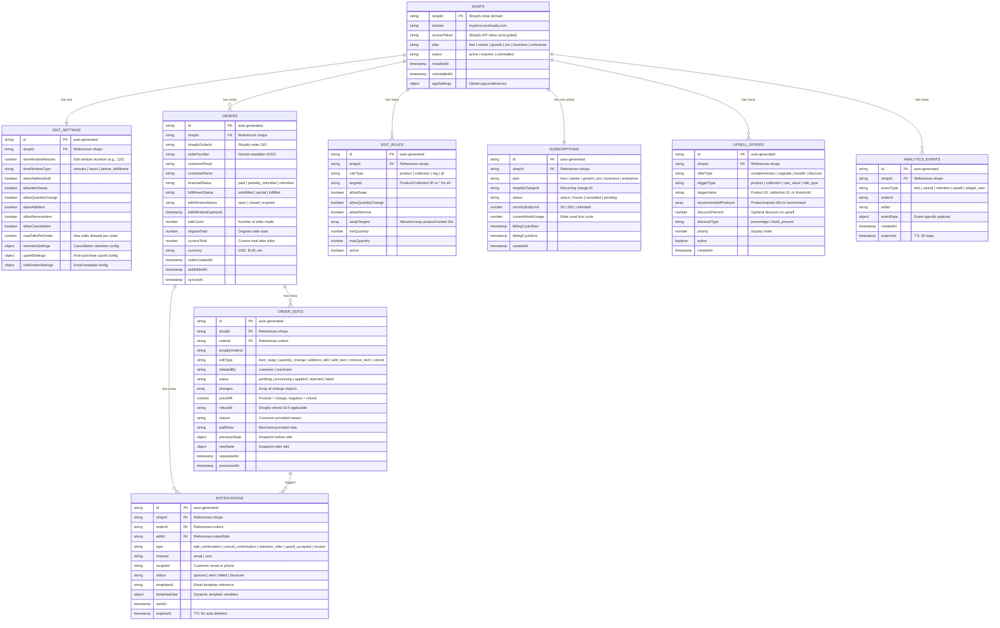
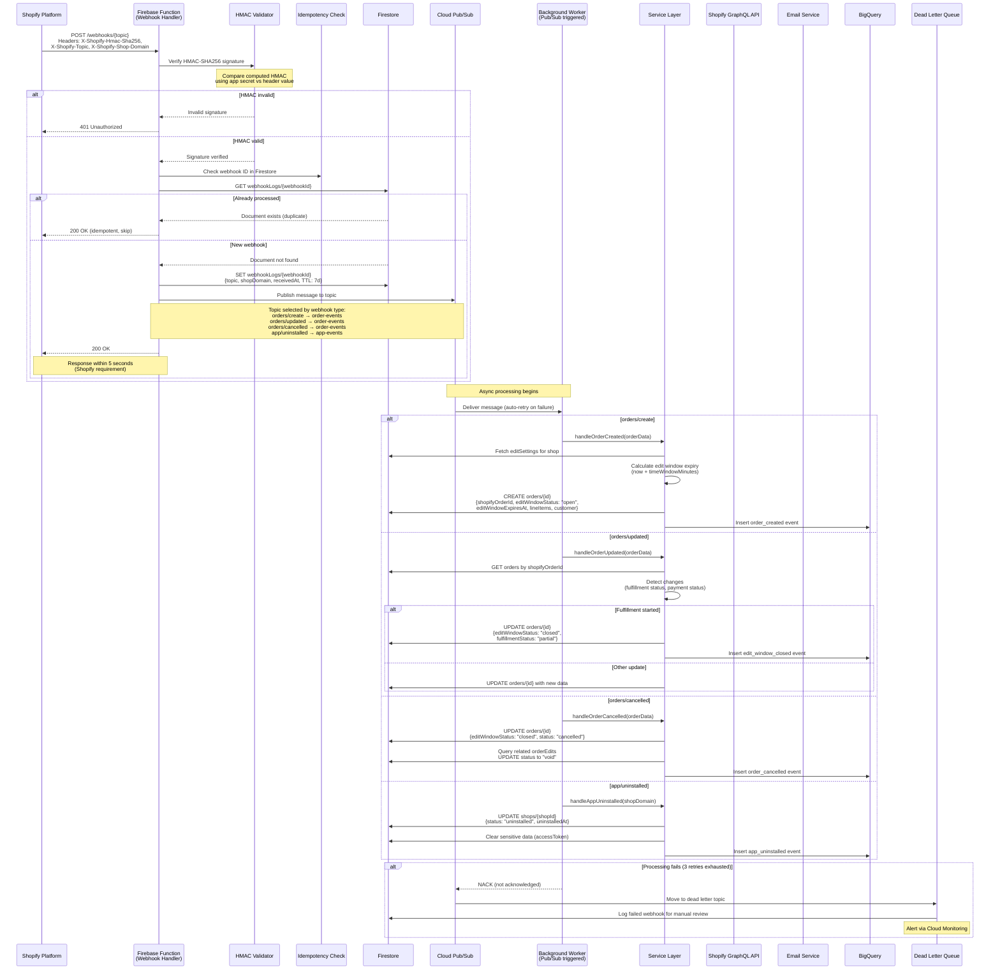

# Technical Diagrams - Avada Order Editing

## 1. System Architecture Diagram



## 2. Order Edit Lifecycle State Machine



## 3. Customer Self-Service Edit Flow (Sequence Diagram)



## 4. Merchant Admin Edit Flow (Sequence Diagram)



## 5. Cancellation Retention Flow



## 6. Post-Purchase Upsell Flow (Sequence Diagram)



## 7. Data Flow Diagram



## 8. Entity Relationship Diagram (ERD)



## 9. Deployment Architecture

```mermaid
graph TB
    subgraph "Client Layer"
        BROWSER[Merchant Browser<br/>Shopify Admin iFrame]
        CUST_BROWSER[Customer Browser<br/>Storefront / Order Status]
    end

    subgraph "CDN / Edge"
        CF[Firebase Hosting CDN<br/>Global Edge Network]
    end

    subgraph "GCP Project: avada-order-editing"
        subgraph "Compute"
            FF_API[Firebase Functions<br/>API Handlers<br/>Node.js 18 | 256MB-1GB RAM<br/>us-central1]
            FF_WH[Firebase Functions<br/>Webhook Handlers<br/>Node.js 18 | 256MB RAM<br/>us-central1]
            FF_BG[Firebase Functions<br/>Background Workers<br/>Pub/Sub triggered<br/>Node.js 18 | 512MB RAM]
            FF_CRON[Firebase Functions<br/>Scheduled Functions<br/>Cloud Scheduler triggered<br/>Edit window expiry, usage reset]
        end

        subgraph "Messaging & Scheduling"
            PUBSUB[Cloud Pub/Sub]
            PUBSUB_T1[Topic: order-events]
            PUBSUB_T2[Topic: edit-events]
            PUBSUB_T3[Topic: notification-events]
            PUBSUB_DLQ[Dead Letter Topic<br/>Failed message retry]

            TASKS[Cloud Tasks]
            TASKS_Q1[Queue: delayed-edits]
            TASKS_Q2[Queue: bulk-operations]

            SCHEDULER[Cloud Scheduler]
            SCHED_1[Every 5 min: expire edit windows]
            SCHED_2[Monthly: reset usage counters]
            SCHED_3[Daily: sync analytics to BigQuery]
        end

        subgraph "Database"
            FIRESTORE[(Cloud Firestore<br/>Native Mode<br/>nam5 multi-region)]
            FIRESTORE_IDX[Compound Indexes<br/>shopId + status<br/>shopId + orderCreatedAt<br/>shopId + editWindowStatus]
        end

        subgraph "Analytics"
            BIGQUERY[(BigQuery<br/>Dataset: order_editing)]
            BQ_P[Partitioned Tables<br/>by _PARTITIONDATE]
            BQ_C[Clustered by<br/>shopId, plan, eventType]
        end

        subgraph "Security"
            SA[Service Accounts<br/>Least privilege per function]
            SM[Secret Manager<br/>API keys, tokens]
        end

        subgraph "Monitoring"
            LOG[Cloud Logging<br/>Structured logs]
            MON[Cloud Monitoring<br/>Alerts & dashboards]
            TRACE[Cloud Trace<br/>Request tracing]
        end
    end

    subgraph "External"
        SHOPIFY[Shopify Platform<br/>GraphQL Admin API<br/>REST Admin API<br/>Webhooks]
        SENDGRID[Email Provider<br/>SendGrid]
        GADDR_API[Google Maps<br/>Address Validation API]
    end

    BROWSER --> CF
    CUST_BROWSER --> CF
    CF --> FF_API

    SHOPIFY -->|Webhooks| FF_WH
    FF_WH --> PUBSUB
    PUBSUB --> PUBSUB_T1
    PUBSUB --> PUBSUB_T2
    PUBSUB --> PUBSUB_T3
    PUBSUB_T1 --> FF_BG
    PUBSUB_T2 --> FF_BG
    PUBSUB_T3 --> FF_BG
    PUBSUB_T1 -.->|On failure| PUBSUB_DLQ

    SCHEDULER --> SCHED_1
    SCHEDULER --> SCHED_2
    SCHEDULER --> SCHED_3
    SCHED_1 --> FF_CRON
    SCHED_2 --> FF_CRON
    SCHED_3 --> FF_CRON

    TASKS --> TASKS_Q1
    TASKS --> TASKS_Q2
    TASKS_Q1 --> FF_BG
    TASKS_Q2 --> FF_BG

    FF_API --> FIRESTORE
    FF_BG --> FIRESTORE
    FF_CRON --> FIRESTORE
    FIRESTORE --> FIRESTORE_IDX

    FF_BG --> BIGQUERY
    FF_CRON --> BIGQUERY
    BIGQUERY --> BQ_P
    BIGQUERY --> BQ_C

    FF_API --> SHOPIFY
    FF_BG --> SHOPIFY
    FF_BG --> SENDGRID
    FF_API --> GADDR_API

    FF_API --> SM
    FF_WH --> SM

    FF_API --> LOG
    FF_BG --> LOG
    LOG --> MON

    style FIRESTORE fill:#f4b400,color:#000
    style BIGQUERY fill:#4285f4,color:#fff
    style PUBSUB fill:#34a853,color:#fff
    style CF fill:#ff9800,color:#fff
```

## 10. Webhook Processing Flow



---

## Diagram Index

| # | Diagram | Type | Purpose |
|---|---------|------|---------|
| 1 | System Architecture | Component | Full system overview with all services and connections |
| 2 | Order Edit Lifecycle | State Machine | All possible states an order edit can be in |
| 3 | Customer Self-Service Edit | Sequence | End-to-end customer edit flow with payment handling |
| 4 | Merchant Admin Edit | Sequence | Merchant-initiated edit via admin dashboard |
| 5 | Cancellation Retention | Sequence | Cancel flow with retention offers to reduce churn |
| 6 | Post-Purchase Upsell | Sequence | Upsell recommendations during edit flow |
| 7 | Data Flow | Data Flow | How data moves through the system |
| 8 | Entity Relationships | ERD | Firestore collections and their relationships |
| 9 | Deployment Architecture | Infrastructure | GCP/Firebase resource topology |
| 10 | Webhook Processing | Sequence | Webhook receipt, validation, and async processing |
