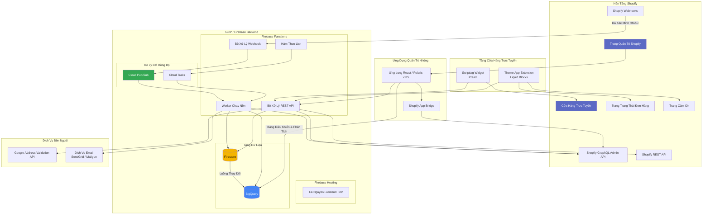
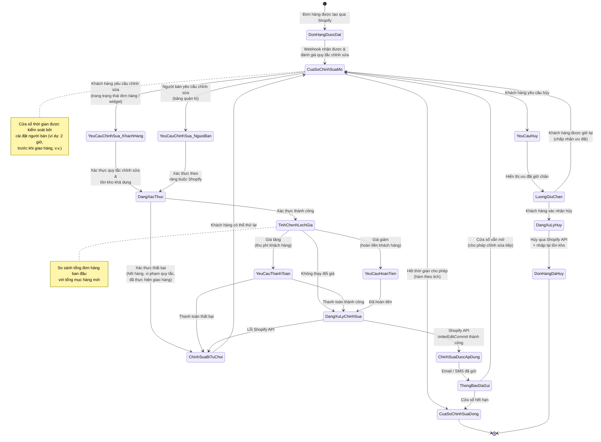
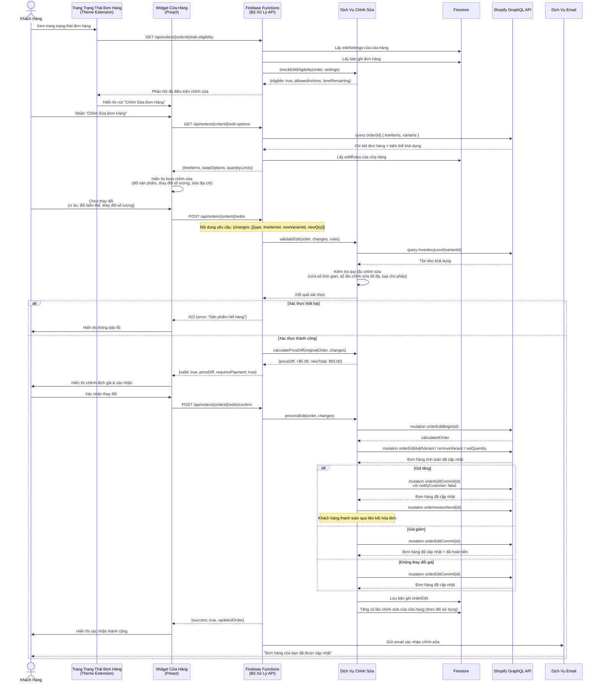
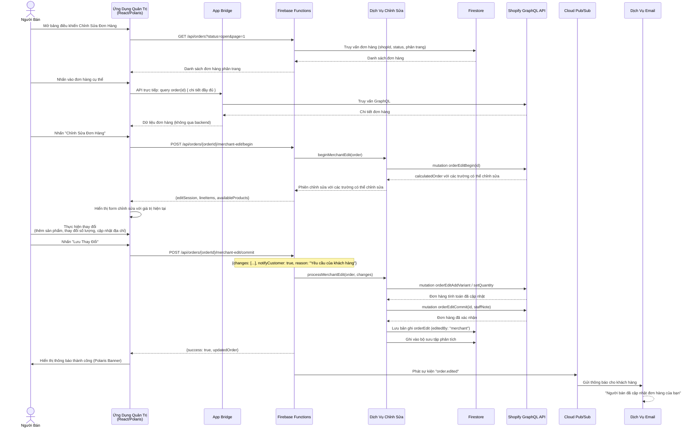
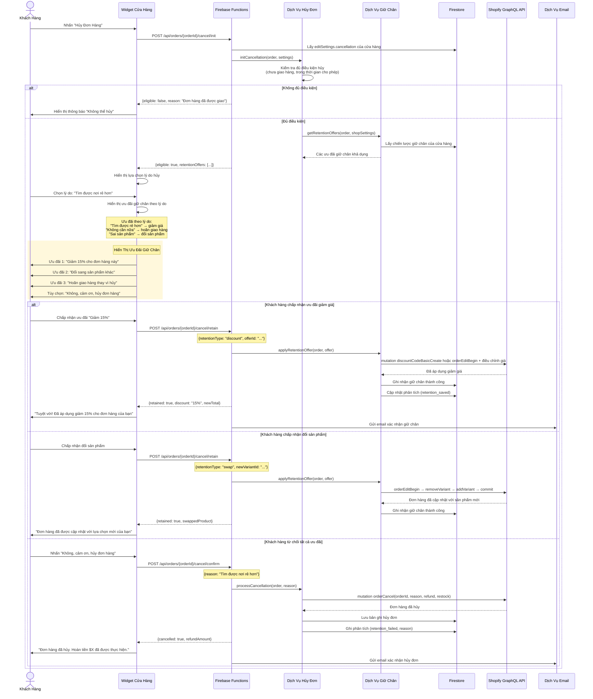
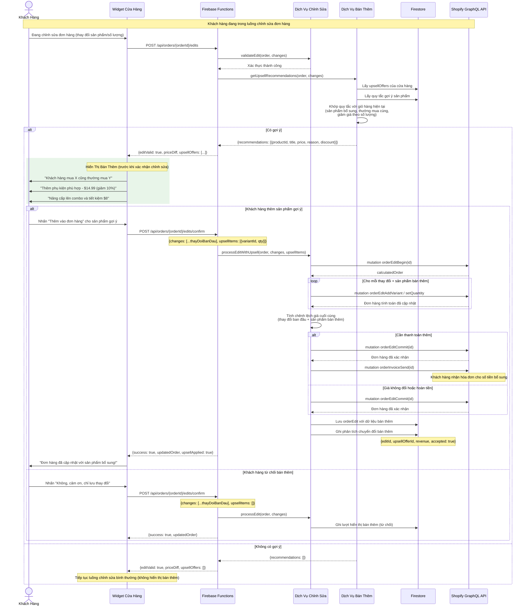
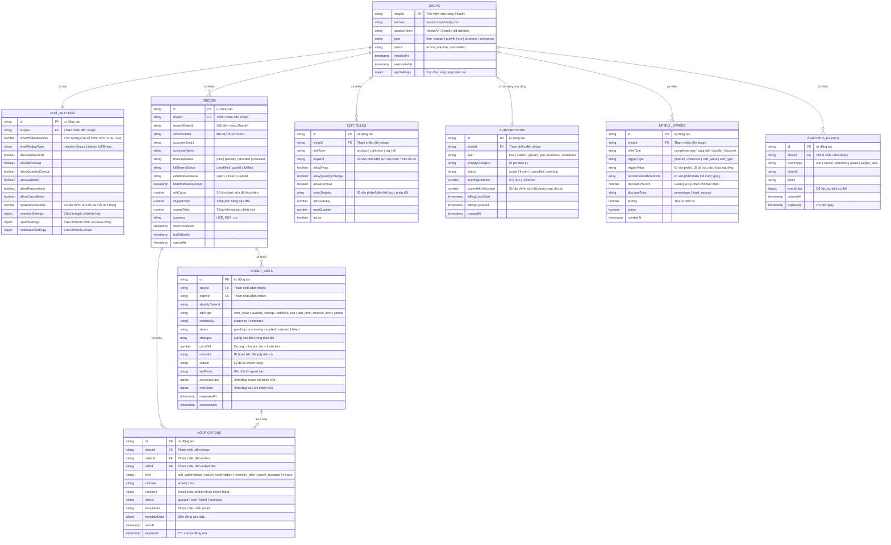
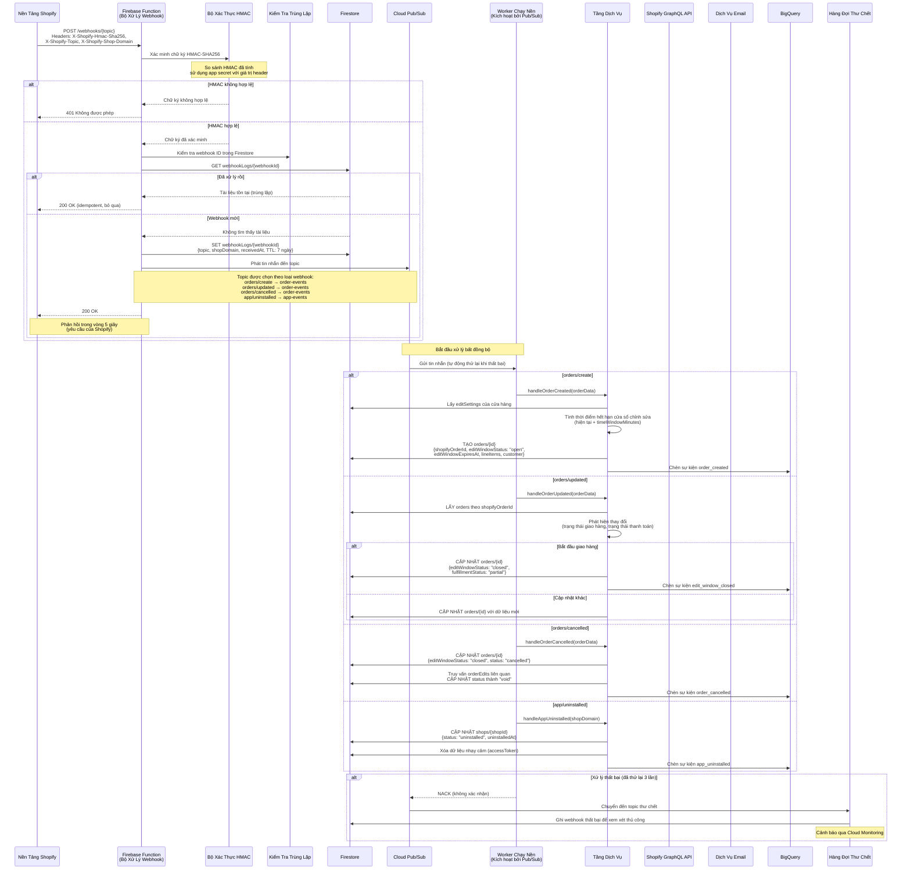

# Sơ Đồ Kỹ Thuật - Avada Order Editing

## 1. Sơ Đồ Kiến Trúc Hệ Thống



## 2. Máy Trạng Thái Vòng Đời Chỉnh Sửa Đơn Hàng



## 3. Luồng Khách Hàng Tự Chỉnh Sửa (Sơ Đồ Tuần Tự)



## 4. Luồng Chỉnh Sửa Từ Trang Quản Trị Người Bán (Sơ Đồ Tuần Tự)



## 5. Luồng Giữ Chân Khi Hủy Đơn



## 6. Luồng Bán Thêm Sau Mua Hàng (Sơ Đồ Tuần Tự)



## 7. Sơ Đồ Luồng Dữ Liệu


## 8. Sơ Đồ Quan Hệ Thực Thể (ERD)



## 9. Kiến Trúc Triển Khai

```mermaid
graph TB
    subgraph "Tầng Khách Hàng"
        BROWSER[Trình Duyệt Người Bán<br/>iFrame Quản Trị Shopify]
        CUST_BROWSER[Trình Duyệt Khách Hàng<br/>Cửa Hàng / Trạng Thái Đơn Hàng]
    end

    subgraph "CDN / Biên"
        CF[Firebase Hosting CDN<br/>Mạng Biên Toàn Cầu]
    end

    subgraph "Dự Án GCP: avada-order-editing"
        subgraph "Tính Toán"
            FF_API[Firebase Functions<br/>Bộ Xử Lý API<br/>Node.js 18 | 256MB-1GB RAM<br/>us-central1]
            FF_WH[Firebase Functions<br/>Bộ Xử Lý Webhook<br/>Node.js 18 | 256MB RAM<br/>us-central1]
            FF_BG[Firebase Functions<br/>Worker Chạy Nền<br/>Kích hoạt bởi Pub/Sub<br/>Node.js 18 | 512MB RAM]
            FF_CRON[Firebase Functions<br/>Hàm Theo Lịch<br/>Kích hoạt bởi Cloud Scheduler<br/>Hết hạn cửa sổ chỉnh sửa, đặt lại sử dụng]
        end

        subgraph "Tin Nhắn & Lập Lịch"
            PUBSUB[Cloud Pub/Sub]
            PUBSUB_T1[Topic: order-events]
            PUBSUB_T2[Topic: edit-events]
            PUBSUB_T3[Topic: notification-events]
            PUBSUB_DLQ[Topic Thư Chết<br/>Thử lại tin nhắn thất bại]

            TASKS[Cloud Tasks]
            TASKS_Q1[Hàng đợi: delayed-edits]
            TASKS_Q2[Hàng đợi: bulk-operations]

            SCHEDULER[Cloud Scheduler]
            SCHED_1[Mỗi 5 phút: hết hạn cửa sổ chỉnh sửa]
            SCHED_2[Hàng tháng: đặt lại bộ đếm sử dụng]
            SCHED_3[Hàng ngày: đồng bộ phân tích sang BigQuery]
        end

        subgraph "Cơ Sở Dữ Liệu"
            FIRESTORE[(Cloud Firestore<br/>Chế Độ Native<br/>nam5 đa vùng)]
            FIRESTORE_IDX[Chỉ Mục Kết Hợp<br/>shopId + status<br/>shopId + orderCreatedAt<br/>shopId + editWindowStatus]
        end

        subgraph "Phân Tích"
            BIGQUERY[(BigQuery<br/>Dataset: order_editing)]
            BQ_P[Bảng Phân Vùng<br/>theo _PARTITIONDATE]
            BQ_C[Phân Cụm theo<br/>shopId, plan, eventType]
        end

        subgraph "Bảo Mật"
            SA[Tài Khoản Dịch Vụ<br/>Quyền tối thiểu cho mỗi hàm]
            SM[Secret Manager<br/>Khóa API, token]
        end

        subgraph "Giám Sát"
            LOG[Cloud Logging<br/>Log có cấu trúc]
            MON[Cloud Monitoring<br/>Cảnh báo & bảng điều khiển]
            TRACE[Cloud Trace<br/>Theo dõi yêu cầu]
        end
    end

    subgraph "Bên Ngoài"
        SHOPIFY[Nền Tảng Shopify<br/>GraphQL Admin API<br/>REST Admin API<br/>Webhooks]
        SENDGRID[Nhà Cung Cấp Email<br/>SendGrid]
        GADDR_API[Google Maps<br/>Address Validation API]
    end

    BROWSER --> CF
    CUST_BROWSER --> CF
    CF --> FF_API

    SHOPIFY -->|Webhooks| FF_WH
    FF_WH --> PUBSUB
    PUBSUB --> PUBSUB_T1
    PUBSUB --> PUBSUB_T2
    PUBSUB --> PUBSUB_T3
    PUBSUB_T1 --> FF_BG
    PUBSUB_T2 --> FF_BG
    PUBSUB_T3 --> FF_BG
    PUBSUB_T1 -.->|Khi thất bại| PUBSUB_DLQ

    SCHEDULER --> SCHED_1
    SCHEDULER --> SCHED_2
    SCHEDULER --> SCHED_3
    SCHED_1 --> FF_CRON
    SCHED_2 --> FF_CRON
    SCHED_3 --> FF_CRON

    TASKS --> TASKS_Q1
    TASKS --> TASKS_Q2
    TASKS_Q1 --> FF_BG
    TASKS_Q2 --> FF_BG

    FF_API --> FIRESTORE
    FF_BG --> FIRESTORE
    FF_CRON --> FIRESTORE
    FIRESTORE --> FIRESTORE_IDX

    FF_BG --> BIGQUERY
    FF_CRON --> BIGQUERY
    BIGQUERY --> BQ_P
    BIGQUERY --> BQ_C

    FF_API --> SHOPIFY
    FF_BG --> SHOPIFY
    FF_BG --> SENDGRID
    FF_API --> GADDR_API

    FF_API --> SM
    FF_WH --> SM

    FF_API --> LOG
    FF_BG --> LOG
    LOG --> MON

    style FIRESTORE fill:#f4b400,color:#000
    style BIGQUERY fill:#4285f4,color:#fff
    style PUBSUB fill:#34a853,color:#fff
    style CF fill:#ff9800,color:#fff
```

## 10. Luồng Xử Lý Webhook



---

## Mục Lục Sơ Đồ

| # | Sơ Đồ | Loại | Mục Đích |
|---|-------|------|----------|
| 1 | Kiến Trúc Hệ Thống | Thành phần | Tổng quan toàn bộ hệ thống với tất cả dịch vụ và kết nối |
| 2 | Vòng Đời Chỉnh Sửa Đơn Hàng | Máy trạng thái | Tất cả trạng thái có thể của một lần chỉnh sửa đơn hàng |
| 3 | Khách Hàng Tự Chỉnh Sửa | Tuần tự | Luồng chỉnh sửa khách hàng từ đầu đến cuối với xử lý thanh toán |
| 4 | Chỉnh Sửa Từ Quản Trị Người Bán | Tuần tự | Chỉnh sửa do người bán thực hiện qua bảng quản trị |
| 5 | Giữ Chân Khi Hủy Đơn | Tuần tự | Luồng hủy đơn với ưu đãi giữ chân để giảm tỷ lệ rời bỏ |
| 6 | Bán Thêm Sau Mua Hàng | Tuần tự | Gợi ý bán thêm trong luồng chỉnh sửa |
| 7 | Luồng Dữ Liệu | Luồng dữ liệu | Cách dữ liệu di chuyển qua hệ thống |
| 8 | Quan Hệ Thực Thể | ERD | Các bộ sưu tập Firestore và quan hệ giữa chúng |
| 9 | Kiến Trúc Triển Khai | Hạ tầng | Cấu trúc tài nguyên GCP/Firebase |
| 10 | Xử Lý Webhook | Tuần tự | Nhận webhook, xác thực và xử lý bất đồng bộ |
