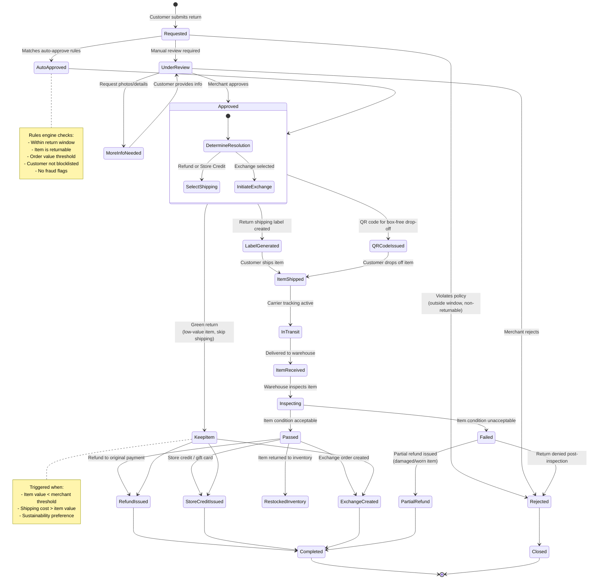
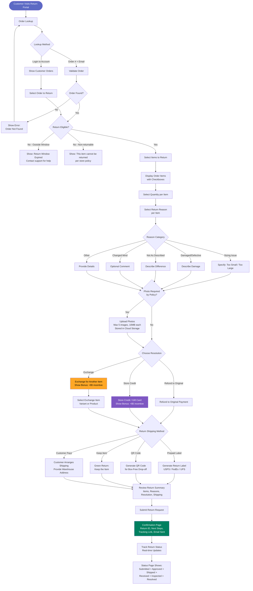
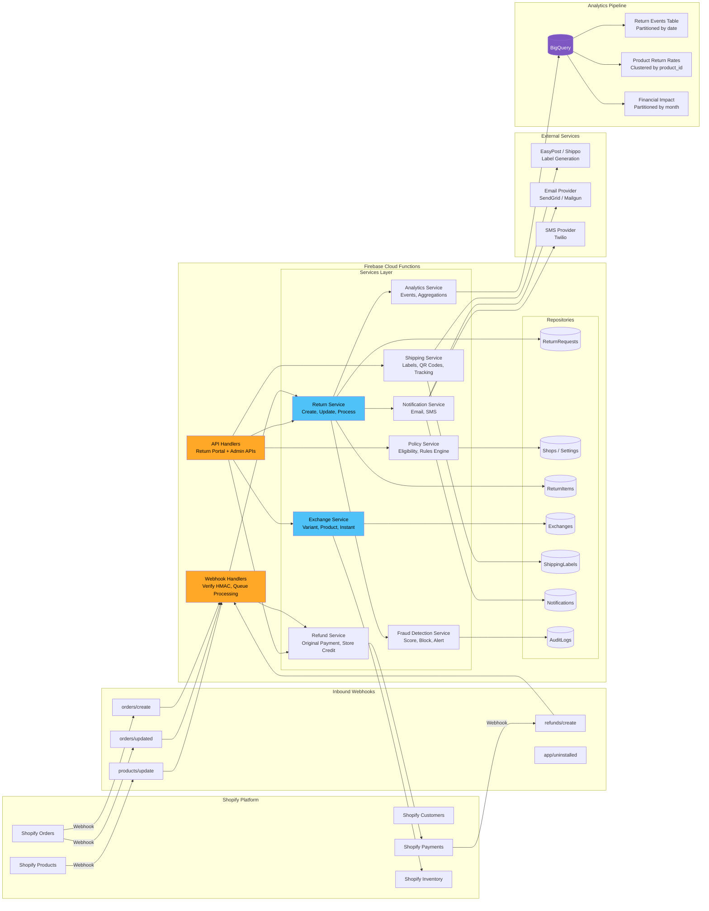
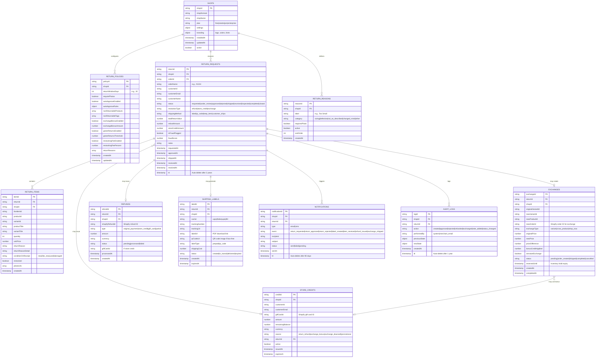
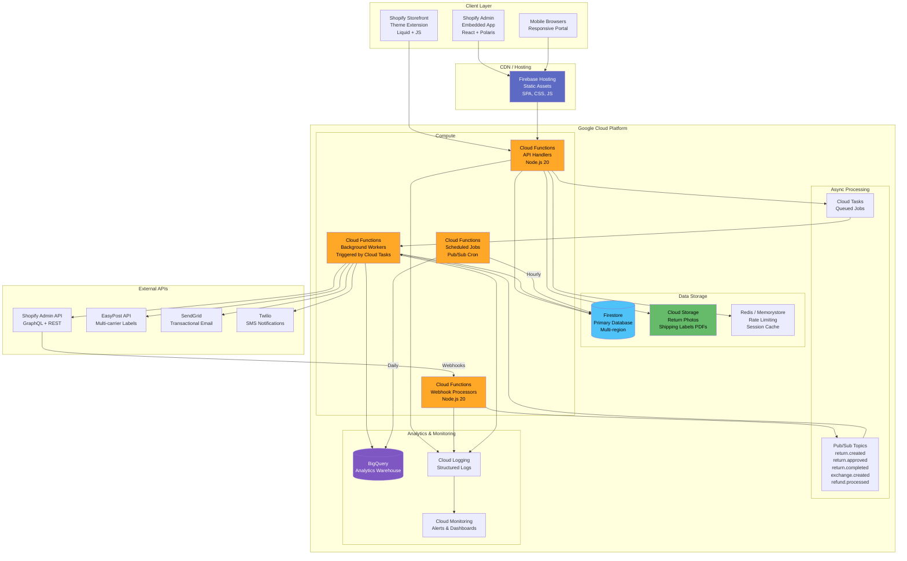
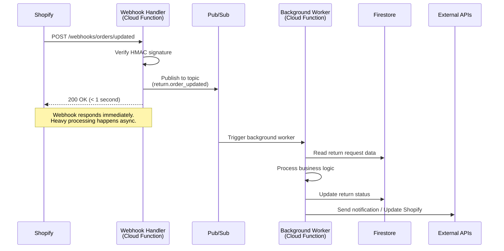
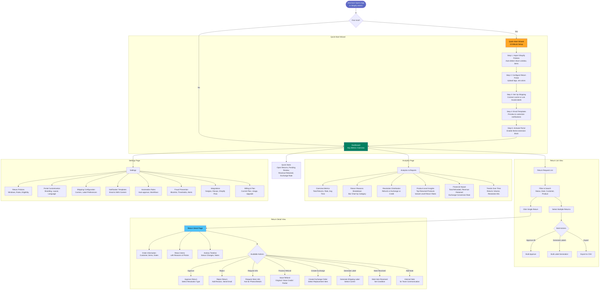

# 08 - Technical Diagrams: Avada Return & Exchange

## 1. System Architecture Diagram

```mermaid
graph TB
    subgraph "Shopify Platform"
        SA[Shopify Admin API<br/>GraphQL + REST]
        SW[Shopify Webhooks<br/>orders/create, orders/updated<br/>refunds/create, app/uninstalled]
        SF[Shopify Flow]
        SPOS[Shopify POS]
    end

    subgraph "Frontend - Shopify Admin App"
        FE[React + Polaris v12+<br/>Embedded Admin App]
        FE_DASH[Dashboard]
        FE_LIST[Return Request List]
        FE_DETAIL[Return Detail View]
        FE_SETTINGS[Settings & Policies]
        FE_ANALYTICS[Analytics Dashboard]
        FE_ONBOARD[Quick-Start Wizard]
        FE --> FE_DASH
        FE --> FE_LIST
        FE --> FE_DETAIL
        FE --> FE_SETTINGS
        FE --> FE_ANALYTICS
        FE --> FE_ONBOARD
    end

    subgraph "Theme Extension"
        TE[Theme App Extension<br/>Liquid Blocks]
        RP[Customer Return Portal<br/>Order Lookup + Return Flow]
        RT[Return Status Tracker]
        RW[Return Prevention Widgets<br/>Size Guides, Return Rate Badges]
        TE --> RP
        TE --> RT
        TE --> RW
    end

    subgraph "Firebase Backend"
        CF[Cloud Functions<br/>Node.js Handlers]
        FS[(Firestore<br/>Multi-tenant Database)]
        CS[Cloud Storage<br/>Return Photos]
        CT[Cloud Tasks<br/>Background Jobs]
        CF --> FS
        CF --> CS
        CF --> CT
    end

    subgraph "Integrations"
        SHIP[Shipping Carriers<br/>via EasyPost / Shippo<br/>USPS, FedEx, UPS, DHL]
        EMAIL[Email Service<br/>Transactional Emails<br/>Status Notifications]
        SMS[SMS Service<br/>Twilio / MessageBird]
        HD[Helpdesk Integrations<br/>Gorgias, Zendesk, Freshdesk]
        KLAV[Klaviyo Integration<br/>Email Marketing Flows]
    end

    subgraph "Analytics"
        BQ[(BigQuery<br/>Return Analytics<br/>Product Insights<br/>Financial Reports)]
    end

    FE <-->|App Bridge API| SA
    FE <-->|HTTPS| CF
    TE <-->|HTTPS| CF
    SW -->|Webhook Events| CF
    CF <-->|GraphQL / REST| SA
    CF --> SHIP
    CF --> EMAIL
    CF --> SMS
    CF <--> HD
    CF <--> KLAV
    CF --> SF
    CF --> BQ
    CT -->|Async Processing| CF
    SPOS -.->|Future: P2| CF

    style FE fill:#5C6AC4,color:#fff
    style TE fill:#008060,color:#fff
    style CF fill:#FFA726,color:#fff
    style FS fill:#4FC3F7,color:#fff
    style BQ fill:#7E57C2,color:#fff
    style SHIP fill:#EF5350,color:#fff
```

---

## 2. Return Request Lifecycle State Machine

---

## 3. Exchange Flow Diagram

```mermaid
flowchart TB
    Start([Customer Initiates Return]) --> SelectItems[Select Items to Return]
    SelectItems --> ChooseResolution{Choose Resolution Type}

    ChooseResolution -->|Refund| RefundFlow[Standard Refund Flow]
    ChooseResolution -->|Store Credit| CreditFlow[Store Credit Flow]
    ChooseResolution -->|Exchange| ExchangeType{Exchange Type}

    ExchangeType -->|Same Product<br/>Different Variant| VariantExchange[Variant Exchange]
    ExchangeType -->|Different Product| ProductExchange[Cross-Product Exchange]
    ExchangeType -->|Shop Now| ShopNowFlow[Browse Store Catalog]

    VariantExchange --> SelectVariant[Select Size / Color / Option]
    ProductExchange --> SelectProduct[Select Replacement Product]
    ShopNowFlow --> BrowseCatalog[Browse Full Catalog<br/>with Return Credit Applied]

    SelectVariant --> CheckInventory{Inventory Available?}
    SelectProduct --> CheckInventory
    BrowseCatalog --> SelectFromCatalog[Customer Selects Item] --> CheckInventory

    CheckInventory -->|Yes| ReserveInventory[Reserve Exchange Item<br/>Hold for 7 days]
    CheckInventory -->|No| SuggestAlternatives[Suggest In-Stock Alternatives<br/>AI Recommendations]
    SuggestAlternatives --> SelectVariant

    ReserveInventory --> PriceComparison{Price Difference?}

    PriceComparison -->|Same Price| NoCharge[No Additional Charge]
    PriceComparison -->|New Item Costs More<br/>Upsell| CollectDifference[Charge Price Difference<br/>to Customer Payment Method]
    PriceComparison -->|New Item Costs Less<br/>Downsell| IssueCredit[Issue Remaining as<br/>Store Credit]

    NoCharge --> BonusCredit{Merchant Offers<br/>Bonus Credit?}
    CollectDifference --> BonusCredit
    IssueCredit --> BonusCredit

    BonusCredit -->|Yes| ApplyBonus[Apply Bonus Credit<br/>e.g., Extra $5 for choosing exchange]
    BonusCredit -->|No| SkipBonus[Continue without bonus]

    ApplyBonus --> InstantExchange{Instant Exchange<br/>Enabled?}
    SkipBonus --> InstantExchange

    InstantExchange -->|Yes - Pro Plan| CreateNewOrder[Create Exchange Order<br/>Ship Immediately]
    InstantExchange -->|No - Standard| WaitForReturn[Wait for Return Receipt<br/>Then Create Exchange Order]

    CreateNewOrder --> HoldCard[Hold Customer Card<br/>as Security Deposit]
    HoldCard --> ShipExchange[Ship Exchange Item]
    ShipExchange --> AwaitReturn[Await Original Item Return]

    WaitForReturn --> CustomerShips[Customer Ships Return]
    CustomerShips --> ReceiveItem[Receive & Inspect Return]
    ReceiveItem --> CreateExchangeOrder[Create Exchange Order]
    CreateExchangeOrder --> ShipExchangeStd[Ship Exchange Item]

    AwaitReturn --> ReturnReceived{Return Received<br/>Within Window?}
    ReturnReceived -->|Yes| ReleaseHold[Release Card Hold]
    ReturnReceived -->|No - Expired| ChargeCard[Charge Security Deposit]

    ReleaseHold --> ExchangeComplete([Exchange Complete])
    ChargeCard --> ExchangeComplete
    ShipExchangeStd --> ExchangeComplete

    style Start fill:#5C6AC4,color:#fff
    style ExchangeComplete fill:#008060,color:#fff
    style InstantExchange fill:#FFA726,color:#000
    style BonusCredit fill:#7E57C2,color:#fff
    style CheckInventory fill:#EF5350,color:#fff
```

---

## 4. Customer Return Portal Flow

---

## 5. Data Flow Diagram

---

## 6. Entity Relationship Diagram

---

## 7. Deployment Architecture

### Webhook Processing Flow (Must Respond < 5 Seconds)

---

## 8. Merchant Admin Flow

---

## Summary

This document contains 8 comprehensive technical diagrams covering the full architecture and user flows for the Avada Return & Exchange app:

| # | Diagram | Purpose |
|---|---------|---------|
| 1 | System Architecture | Overall system topology and integrations |
| 2 | Return Request Lifecycle | State machine with all status transitions and edge cases |
| 3 | Exchange Flow | Complete exchange process including variant, cross-product, Shop Now, instant exchange, and price difference handling |
| 4 | Customer Return Portal | End-to-end customer journey from order lookup to tracking |
| 5 | Data Flow | How data moves between Shopify, Firebase, external services, and BigQuery |
| 6 | Entity Relationship | Full database schema with all collections and relationships |
| 7 | Deployment Architecture | GCP/Firebase topology with async processing and webhook flow |
| 8 | Merchant Admin Flow | Admin dashboard navigation, actions, and settings |

All diagrams are based on the feature matrix (02), target audience requirements (03), opportunity scoring (04), and competitive analysis (05-06) from previous research files. The architecture is designed to support the proposed pricing tiers: Free (50 returns), Starter ($9/150 returns), Pro ($29/500 returns), and Enterprise ($99/2,000 returns).
